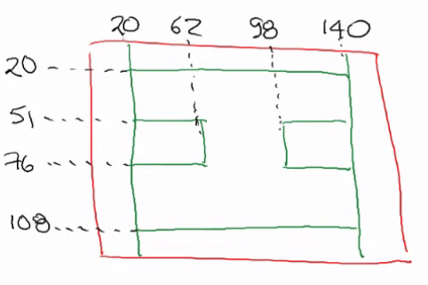

Universidad Nacional De Colombia\
Tecnología Digital 2020-I

Grupo 4\
Juan Camilo Vargas `jcvargasq@unal.edu.co` \
Sergio Alejandro Vargas `savargasqu@unal.edu.co`

## Tarea 11 – Animacióne de un bitmap

Tomar el ejemplo mostrado en clase, y complementar el movimiento de la imagen para recorrer el perímetro interior de la figura indicada en la imagen a continuación:

